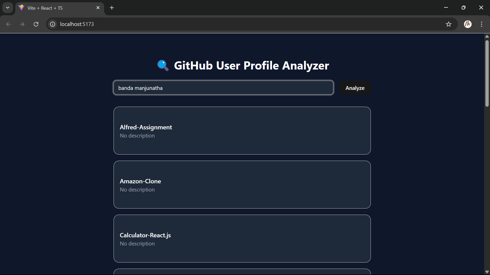

# 🚀 GitHub Profile Analyzer

A sleek, modern web app to analyze any GitHub user's public profile activity. Just type a name like `banda-manjunatha`, hit Enter, and boom — you'll get a full list of public repositories and a visualized commit chart if available.

## 📸 Preview

 <!-- Replace with your actual screenshot file -->

---

## 🛠️ Tech Stack

- **React + TypeScript** – Core framework
- **Tailwind CSS** – Styling
- **ShadCN/UI** – UI components
- **Recharts** – Charting
- **Lucide-react** – Icons
- **Vite** – Fast bundler

---

## ✨ Features

- 🔍 Input-based GitHub username search
- 📂 Displays all public repositories
- 📊 Recent commit chart (via GitHub Events API)
- ✅ Handles:
  - Empty input
  - Invalid usernames
  - Missing hyphen/dashes
  - Case-insensitive input
  - No commits? Shows fallback text
- 📑 Pagination support for repos (10 at a time)
- 🌚 Dark UI with gradients and nice spacing
- ⚠️ Error UI for bad responses or network issues

---

## 📦 Project Structure

```
📦 src
 ┣ 📂 components
 ┃ ┣ 📂 ui              # ShadCN UI Components (Button, Card, Input, etc.)
 ┃ ┣ 📜 CommitsChart.tsx  # Component to display GitHub commit activity chart
 ┃ ┗ 📜 RepoList.tsx      # Component to show list of user repositories
 ┣ 📂 lib               # Utilities (GitHub API handlers, helpers, etc.)
 ┣ 📂 pages
 ┃ ┗ 📜 Home.tsx         # Main homepage with user input + layout
 ┣ 📜 App.tsx            # Root React component
 ┣ 📜 index.css          # Tailwind CSS styles and custom overrides
 ┗ 📜 main.tsx           # Entry point for the React app
```

## 🏗️ Installation & Setup

To run this project locally, follow these steps:

1. **Clone the repository**

   ```sh
   git clone https://github.com/Banda-Manjunatha/Profile-Analyzer-Assignment.git
   cd profile-analyzer
   ```

2. **Install dependencies**

   ```sh
   npm install
   ```

3. **Start the development server**

   ```sh
   npm run dev
   ```

4. **Open in browser**
   Navigate to `http://localhost:5173`.

## 🚀 Deployment

This project is deployed on **[Netlify](https://manju-git-profile-analyzer.netlify.app/)**.

## 👤 Author

- **Manjunatha Banda**
- [GitHub](https://github.com/Banda-Manjunatha)
- [LinkedIn](https://www.linkedin.com/in/manjunatha-banda)
